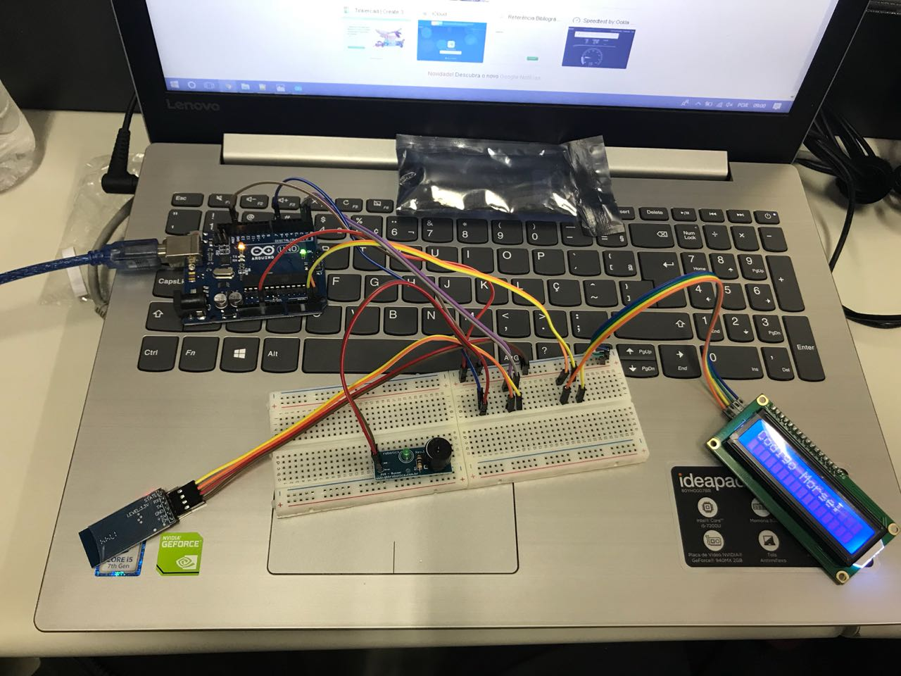

# Codigo-Morse

## Autores: Andressa Marques, João Coelho, Reinaldo Reiche e Zewu Chen

## Descrição:

Esse projeto tem como objetivo transformar alguma palavra digitada pelo usuário para código Morse. Para digitar as palavras que seram transcritas, o usuário deve baixar o aplicativo "Bluetooth Serial", disponivel na Play Store. Com o aplicativo, ele conecta o bluetooth do celular com o do módulo acoplado no Arduino. Quando alguma palavra e enviada através do celular, a partir do código feito, ela será mostrada pelo Display no LCD em código Morse instantaneamente, letra por letra. A cada letra mostrada o Buzzer reproduz um som para ponto e outro para traço (Código Morse), assim permitindo que o usuário tenha uma idéia de como o código funciona.

## Componentes necessários:

*	Arduino Uno R3
*	Módulo bluetooth HC-05
*	Módulo Buzzer
*	Display LCD com módulo I2C
*	Protoboard 740 pontos
*	10 Fios jumper (Macho-Macho) (Opcionais)
* 10 cabos jumper (Fêmea-Macho)

## Instalação:

* A primeira coisa a fazer é baixar e instalar o Arduino IDE, para poder executar os programas no arduino, e baixar também a biblioteca LiquidCrystal_I2C, para poder manusear o display LCD.
* Instalação dos módulos:
  * Módulo Bluetooth HC-05: Pegue quatro jumpers (Fêmea_Macho) e conecte a parte fêmea nos pinos do módulo. Pegue os cabos                conectados nos pinos GND e VCC (5V), e conecte na parte negativa e positiva da protoboard, respectivamente. Após os esses dois        jumpers conectados, sobraram o RX, receptor, e o TX, transmissor. Pegue o jumper que esta conectado no pino RX do módulo e conecte    na entrada TX do Arduino, e o jumper TX conecte na entrada RX do Arduino. 
  * Display LCD: Pegue quatro jumpers (Fêmer-Macho) e conecte a parte fêmea nos quatro pinos centrais do módulo LCD. O pino GND e o       pino VCC devem ser conectados nas partes negativas e positivas, respectivamente. Os outros dois pinos, SDA e SCL, serão conectados     nas   portas analógicas do Arduino, neste caso A4 e A5, respectivamente.
  * Módulo Buzzer: O Buzzer tem apenas dois pinos de saída, que são GND e Sinal. O GND será conectado por um jumper (Fêmea-Macho)         na parte negativa da protoboard e o Sinal será conectado na entrada 6 do Arduino.
* Depois de tudo conectado no Arduino, abra o Arduino IDE e conecte o Arduino pelo cabo USB do computador. Após conectado, copie o código que está disponível no final deste arquivo, e cole na área de código do Arduino IDE. Depois de ter feito esses passos, clique no botão "Verificar" e quando acaba a verificação, clique no botão "Carregar", e assim então o Arduino receberá o código colocado no programa.

## Esquemas: 

### Esquema montado no programa "Fritzing":

### Esquema físico:

